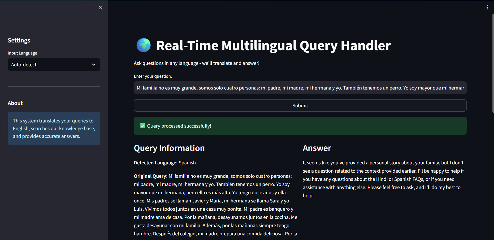

Real-Time Multilingual Query Handler

A robust Retrieval-Augmented Generation (RAG) system that breaks down language barriers. This application allows users to ask customer support questions in any language, translates them to English for processing, searches a knowledge base, and returns accurate answers in the user's native tongue.

Application Screenshots

1. Main Interface

The main chat interface where users can input queries in their preferred language.

2. Multilingual Response Example

Example of the system detecting Hindi, translating to English, retrieving context, and answering.

🚀 Features

Language Agnostic: Auto-detects and supports input in over 7 languages (Spanish, French, Chinese, Hindi, Arabic, etc.).

Real-Time Translation: Powered by Groq's Llama 3 models for ultra-fast translation and response generation.

RAG Architecture: Retrieves accurate information from a custom knowledge base using ChromaDB vector search.

Transparent Process: Displays the detected language, the translated query, and the source documents used to generate the answer.

Chat History: Keeps track of the conversation context for follow-up questions.

🛠️ Tech Stack

Frontend: Streamlit

LLM & Translation: Groq API (Llama-3.3-70b-versatile)

Vector Store: ChromaDB

Embeddings: Sentence Transformers (all-MiniLM-L6-v2)

Orchestration: LangChain

Language: Python 3.10+

📂 Project Structure

multilingual-query-handler/
├── data/
│   ├── raw/                  # Raw text files for knowledge base
│   └── processed/            # Cleaned data
├── src/
│   ├── config.py             # Configuration settings (API keys, models)
│   ├── data_collection.py    # Document loading logic
│   ├── preprocessing.py      # Text cleaning
│   ├── chunking.py           # Splitting text into manageable chunks
│   ├── embeddings.py         # Vector store management
│   ├── translation.py        # Translation logic using Groq
│   └── query_engine.py       # Core RAG logic
├── ui/
│   └── app.py                # Streamlit frontend application
├── main.py                   # Script to build the knowledge base
├── requirements.txt          # Python dependencies
└── README.md                 # Project documentation

⚙️ Installation & Setup

1. Clone the Repository

git clone <repository-url>
cd multilingual-query-handler

2. Set Up Environment Variables

Create a .env file in the root directory and add your Groq API key:

GROQ_API_KEY=gsk_your_actual_api_key_here

3. Install Dependencies

It is recommended to use a virtual environment.

pip install -r requirements.txt

Note: If you encounter errors with sentence-transformers, ensure huggingface-hub is up to date.

🏃‍♂️ Usage

Step 1: Build the Knowledge Base

Before running the app, you must ingest your data into the vector store.

Place your text files (e.g., multilingual_queries.txt) in data/raw/.

Run the ingestion script:

python main.py

This collects data, chunks it, and saves embeddings to ChromaDB.

Step 2: Run the Application

To start the web interface, run the following command from the root directory:

PYTHONPATH=. streamlit run ui/app.py

Note on PYTHONPATH=.: This prefix is crucial. It ensures that Python can locate the modules inside the src/ folder when running the Streamlit app from the root.

Step 3: Access the App

Open your browser and navigate to the URL provided in the terminal, typically:

Local: http://localhost:8501

Codespaces: Click the "Forwarded Address" link in the Ports tab.

